# Umer Saleem

**Full-stack Web Developer · Laravel & PHP · Pakistan**

I build web applications that connect clear user interfaces with practical backend systems. My main focus is Laravel, PHP, MySQL and modern JavaScript, with work across admin dashboards, REST APIs, business applications and responsive websites.

[Portfolio](https://candycodecoffe.site/) · [LinkedIn](https://www.linkedin.com/in/umer-saleem-4154ba1ba/) · [Email](mailto:umer.saleem.abbasi109@gmail.com) · [Selected projects](#selected-projects) · [Technical skills](#technical-skills) · [Contribution activity](#contribution-activity)

---

## About me

I enjoy turning complex workflows into applications that are straightforward to use and maintain. My repositories include Laravel applications, React interfaces, API development and a full-stack retail workspace built with Next.js and MySQL.

I am particularly interested in backend architecture, database design and performance tuning. I continue to develop my skills in advanced Laravel, React integration and system optimization, and I welcome collaboration on web applications, REST APIs and dashboard projects.

## What I build

- **Business applications:** admin dashboards, product catalogs, customer records and operational workflows.
- **Backend systems:** REST APIs, authentication, input validation and database-driven CRUD features.
- **Modern interfaces:** responsive websites, reusable React components and practical forms.
- **Retail workflows:** checkout, inventory tracking, invoicing, reporting and role-based access.

## Highlights & achievements

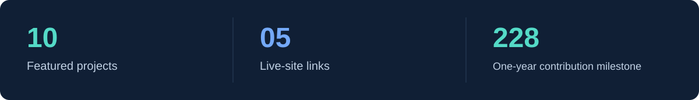

- **Ten featured projects** covering university platforms, retail operations, service management, healthcare and business websites.
- **Five live-site links** connecting this portfolio to published institutional and company websites.
- **228 contributions in a one-year profile snapshot** — a personal contribution milestone.
- **Full-stack project experience** spanning Laravel/PHP applications and a Next.js/TypeScript retail workspace.

## Selected projects

Ten selected projects across institutional platforms, retail software, service applications and business websites.

<table>
<tr>
<td width="50%" valign="top">
<a href="https://github.com/Umersaleem98/POS">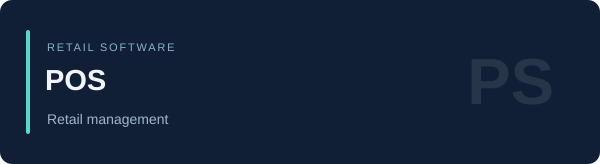</a>
<h3>POS</h3>

Checkout, inventory, invoices, reporting and configurable role permissions in a complete web-based retail workspace.

<strong>Technology:</strong> Next.js · TypeScript · MySQL/MariaDB

<a href="https://github.com/Umersaleem98/POS">View source</a> · <a href="https://github.com/Umersaleem98/POS#screenshots">Screenshots ↗</a>

</td>
<td width="50%" valign="top">
<a href="https://github.com/Umersaleem98/NUST-Endowment-Catalogue">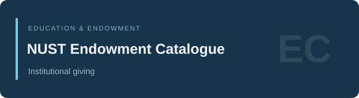</a>
<h3>NUST Endowment Catalogue</h3>

An institutional catalogue presenting endowment programs, scholarship support and opportunities to fund student-focused initiatives.

<strong>Technology:</strong> Laravel · PHP · Blade

<a href="https://github.com/Umersaleem98/NUST-Endowment-Catalogue">Private source</a> · <a href="https://endowment-catalogue.nust.edu.pk/">Live website ↗</a>

</td>
</tr>
<tr>
<td width="50%" valign="top">
<a href="https://github.com/Umersaleem98/NUST-Sharing-Network">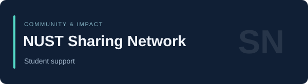</a>
<h3>NUST Sharing Network</h3>

A student-support platform with pages for exploring needs, sharing student stories and presenting community impact.

<strong>Technology:</strong> Laravel · PHP · JavaScript

<a href="https://github.com/Umersaleem98/NUST-Sharing-Network">View source</a> · <a href="https://sharing-network.nust.edu.pk/">Live website ↗</a>

</td>
<td width="50%" valign="top">
<a href="https://github.com/Umersaleem98/GraFlex-website">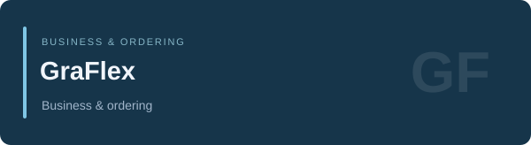</a>
<h3>GraFlex</h3>

A business website with order submission, order tracking, account registration and an authenticated dashboard.

<strong>Technology:</strong> Laravel · PHP · HTML/JavaScript

<a href="https://github.com/Umersaleem98/GraFlex-website">View source</a> · <a href="http://graflex.site/">Live website ↗</a>

</td>
</tr>
<tr>
<td width="50%" valign="top">
<a href="https://github.com/Umersaleem98/aone-international">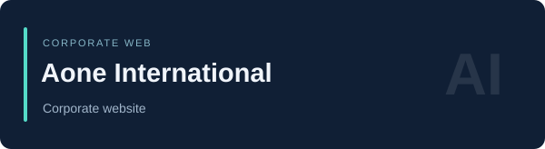</a>
<h3>Aone International</h3>

A Laravel-based company website presenting Aone International through a dedicated public web presence.

<strong>Technology:</strong> Laravel · PHP · Blade

<a href="https://github.com/Umersaleem98/aone-international">Private source</a> · <a href="https://aoneinternational.com.pk/">Live website ↗</a>

</td>
<td width="50%" valign="top">
<a href="https://github.com/Umersaleem98/handyhub_services">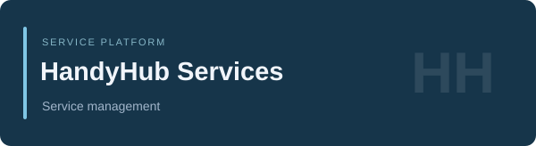</a>
<h3>HandyHub Services</h3>

A service-focused application with account registration, an administration dashboard, user verification and service management.

<strong>Technology:</strong> Laravel · PHP · Blade

<a href="https://github.com/Umersaleem98/handyhub_services">View source</a>

</td>
</tr>
<tr>
<td width="50%" valign="top">
<a href="https://github.com/Umersaleem98/NUST-Alumni-Office-Portal-UI">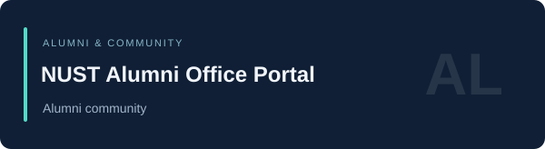</a>
<h3>NUST Alumni Office Portal</h3>

An alumni-facing portal with chapters, events, privileges, community connections and giving-back information.

<strong>Technology:</strong> Laravel · PHP · JavaScript

<a href="https://github.com/Umersaleem98/NUST-Alumni-Office-Portal-UI">View source</a> · <a href="https://alumni.nust.edu.pk/">Live website ↗</a>

</td>
<td width="50%" valign="top">
<a href="https://github.com/Umersaleem98/NUST-Financial-Aid-Office">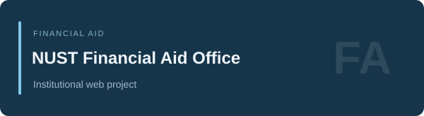</a>
<h3>NUST Financial Aid Office</h3>

A Laravel web project for NUST's Financial Aid Office, extending my portfolio of institutional applications.

<strong>Technology:</strong> Laravel · PHP · Blade

<a href="https://github.com/Umersaleem98/NUST-Financial-Aid-Office">Private source</a>

</td>
</tr>
<tr>
<td width="50%" valign="top">
<a href="https://github.com/Umersaleem98/Alkurshid_project">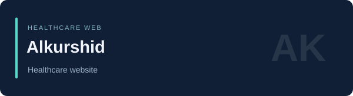</a>
<h3>Alkurshid</h3>

A healthcare website presenting services, doctors and departments, with contact and appointment request forms.

<strong>Technology:</strong> Laravel · PHP · JavaScript

<a href="https://github.com/Umersaleem98/Alkurshid_project">View source</a>

</td>
<td width="50%" valign="top">
<a href="https://github.com/Umersaleem98/nutridrive">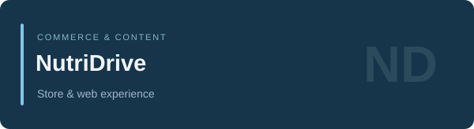</a>
<h3>NutriDrive</h3>

A Laravel web application combining a product-store interface, account access and informational website pages.

<strong>Technology:</strong> Laravel · PHP · JavaScript

<a href="https://github.com/Umersaleem98/nutridrive">View source</a>

</td>
</tr>
</table>

Private source links are available to authorized collaborators. The live website links above are provided separately for portfolio viewing.

[Browse all public repositories →](https://github.com/Umersaleem98?tab=repositories)

## Technical skills

### Primary development stack

| Discipline | Technologies | Areas of focus |
| --- | --- | --- |
| Backend development | Laravel, PHP, Node.js | REST APIs, application workflows, authentication and validation |
| Frontend development | React, Next.js, JavaScript, TypeScript | Component-based interfaces, forms and client/server integration |
| Interface styling | HTML, CSS, Tailwind CSS, Bootstrap | Responsive layouts, reusable styling and dashboard interfaces |
| Relational data | MySQL, MariaDB | Schema design, CRUD operations, transactions and reporting |
| Development workflow | Git, GitHub, GitLab, Jira | Version control, issue tracking and project organization |
| Build & local environment | Vite, npm, Apache, XAMPP | Frontend tooling and local application setup |

### Additional technologies

My broader toolkit includes the following technologies alongside my primary web development stack.

| Category | Technologies |
| --- | --- |
| Programming languages | Python, C, C++ |
| Backend frameworks | Django, Express.js, NestJS |
| Frontend framework | Vue.js |
| Data & cloud platforms | PostgreSQL, MongoDB, Firebase, AWS |
| Operating environment | Linux fundamentals |

## Contribution activity

The animated snake below follows my GitHub contribution graph and refreshes daily. The 228-contribution milestone is a one-year snapshot; the animation reflects the currently available contribution graph.

<picture>
  <source media="(prefers-color-scheme: dark)" srcset="https://raw.githubusercontent.com/Umersaleem98/Umersaleem98/output/github-snake-dark.svg">
  <source media="(prefers-color-scheme: light)" srcset="https://raw.githubusercontent.com/Umersaleem98/Umersaleem98/output/github-snake.svg">
  
</picture>

[View contribution history](https://github.com/Umersaleem98#contributions) · [Animation workflow](https://github.com/Umersaleem98/Umersaleem98/actions/workflows/contribution-snake.yml)

## How I approach development

I aim for readable code, clear application structure and interfaces that make everyday tasks easier. I pay attention to input validation, access boundaries and data consistency, and I value documentation that helps another developer understand and run a project.

My current learning priorities are advanced Laravel patterns, frontend/backend integration, backend architecture and performance optimization.

## Connect with me

I am open to collaboration on Laravel applications, REST APIs, admin dashboards and full-stack web projects. Share your project context, the problem you want to solve and the scope of the work.

| Channel | Link |
| --- | --- |
| Portfolio | [candycodecoffe.site](https://candycodecoffe.site/) |
| Email | [umer.saleem.abbasi109@gmail.com](mailto:umer.saleem.abbasi109@gmail.com) |
| LinkedIn | [Umer Saleem](https://www.linkedin.com/in/umer-saleem-4154ba1ba/) |
| WhatsApp | [+92 312 2096659](https://wa.me/923122096659) |
| YouTube | [Web Tech with DX](https://www.youtube.com/@webtechwithdx9544) |
| Instagram | [@candycode153](https://www.instagram.com/candycode153/) |
