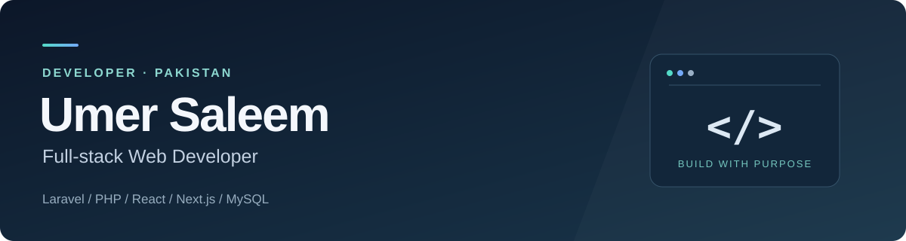

# Umer Saleem

**Full-stack Web Developer · Laravel & PHP · Pakistan**

I build web applications that connect clear user interfaces with practical backend systems. My main focus is Laravel, PHP, MySQL and modern JavaScript, with work across admin dashboards, REST APIs, business applications and responsive websites.

[LinkedIn](https://www.linkedin.com/in/umer-saleem-4154ba1ba/) · [Email](mailto:umer.saleem.abbasi109@gmail.com) · [Selected projects](#selected-projects) · [Technical skills](#technical-skills)

---

## About me

I enjoy turning complex workflows into applications that are straightforward to use and maintain. My repositories include Laravel applications, React interfaces, API development and a full-stack retail workspace built with Next.js and MySQL.

I am particularly interested in backend architecture, database design and performance tuning. I continue to develop my skills in advanced Laravel, React integration and system optimization, and I welcome collaboration on web applications, REST APIs and dashboard projects.

## What I build

- **Business applications:** admin dashboards, product catalogs, customer records and operational workflows.
- **Backend systems:** REST APIs, authentication, input validation and database-driven CRUD features.
- **Modern interfaces:** responsive websites, reusable React components and practical forms.
- **Retail workflows:** checkout, inventory tracking, invoicing, reporting and role-based access.

## Technical skills

### Primary development stack

| Discipline | Technologies | Areas of focus |
| --- | --- | --- |
| Backend development | Laravel, PHP, Node.js | REST APIs, application workflows, authentication and validation |
| Frontend development | React, Next.js, JavaScript, TypeScript | Component-based interfaces, forms and client/server integration |
| Interface styling | HTML, CSS, Tailwind CSS, Bootstrap | Responsive layouts, reusable styling and dashboard interfaces |
| Relational data | MySQL, MariaDB | Schema design, CRUD operations, transactions and reporting |
| Development workflow | Git, GitHub, GitLab, Jira | Version control, issue tracking and project organization |
| Build & local environment | Vite, npm, Apache, XAMPP | Frontend tooling and local application setup |

### Additional technologies

My broader toolkit includes the following technologies alongside my primary web development stack.

| Category | Technologies |
| --- | --- |
| Programming languages | Python, C, C++ |
| Backend frameworks | Django, Express.js, NestJS |
| Frontend framework | Vue.js |
| Data & cloud platforms | PostgreSQL, MongoDB, Firebase, AWS |
| Operating environment | Linux fundamentals |

## Selected projects

### POS — Retail management workspace

A web-based point of sale application bringing checkout, stock, billing and reporting into one workspace. It includes configurable role permissions, store-scoped access, transaction-safe stock updates, invoices and CSV/PDF reports.

**Stack:** Next.js · React · TypeScript · MySQL/MariaDB
[Explore repository](https://github.com/Umersaleem98/POS) · [View screenshots](https://github.com/Umersaleem98/POS#screenshots)

### Multi-Step Registration Form

A Laravel application that guides students through personal, department and course details in a structured registration flow.

**Stack:** Laravel · PHP · Bootstrap
[Explore repository](https://github.com/Umersaleem98/Multi-Step-Form)

### MockSheet — Practice test application

A browser-based mock test application with Excel question imports, timed tests, automatic scoring and answer review. Data persists in localStorage; the application runs without a backend server.

**Stack:** React · Vite · JavaScript · localStorage
[Explore repository](https://github.com/Umersaleem98/Mock-Test-Application-)

### React To-Do List

A responsive task management application with task creation, editing, completion, deletion and drag-and-drop ordering.

**Stack:** React · Bootstrap · React Icons · @hello-pangea/dnd
[Explore repository](https://github.com/Umersaleem98/react-todo-list-app)

### Laravel REST API

A Laravel repository focused on REST API development, complementing my work on database-driven PHP applications.

**Stack:** Laravel · PHP
[Explore repository](https://github.com/Umersaleem98/Rest_API_in_laravel)

[Browse all public repositories →](https://github.com/Umersaleem98?tab=repositories)

## How I approach development

I aim for readable code, clear application structure and interfaces that make everyday tasks easier. I pay attention to input validation, access boundaries and data consistency, and I value documentation that helps another developer understand and run a project.

My current learning priorities are advanced Laravel patterns, frontend/backend integration, backend architecture and performance optimization.

## Connect with me

I am open to collaboration on Laravel applications, REST APIs, admin dashboards and full-stack web projects. Share your project context, the problem you want to solve and the scope of the work.

| Channel | Link |
| --- | --- |
| Email | [umer.saleem.abbasi109@gmail.com](mailto:umer.saleem.abbasi109@gmail.com) |
| LinkedIn | [Umer Saleem](https://www.linkedin.com/in/umer-saleem-4154ba1ba/) |
| WhatsApp | [+92 312 2096659](https://wa.me/923122096659) |
| YouTube | [Web Tech with DX](https://www.youtube.com/@webtechwithdx9544) |
| Instagram | [@candycode153](https://www.instagram.com/candycode153/) |
